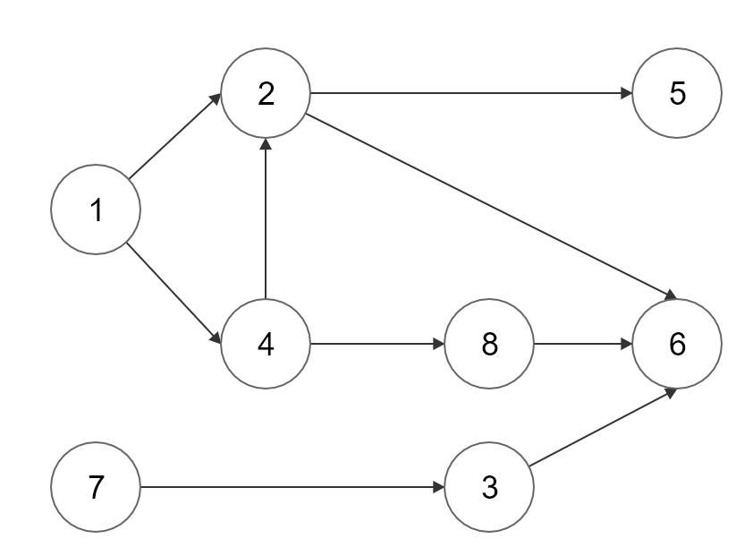

# 위상정렬(Topological Sort)

## 1. 정의
> 방향 그래프에서 간선으로 주어진 정점 간의 선후관계(간선)를 위배하지 않도록 나열하는 정렬



위와 같은 그래프 상에서, 노드를 방문할 때 화살표로 표기된 노드를 먼저 방문하여야 방문할 수 있다고 가정하면
아래와 같은 선후관계를 가진다.

### 선후관계
| node 1 |       node 2       | node 3 | node 4 | node 5 |             node 6             | node 7 | node 8 |
|:------:|:------------------:|:------:|:------:|:------:|:------------------------------:|:------:|--------|
|   -    | node 1<br/> node 4 | node 7 | node 1 | node 2 | node 2<br/> node 3<br/> node 8 |   -    | node 4 |


위 그래프의 선후관계를 만족하는 위상정렬의 결과는 여러가지가 존재할 수 있다.
* 어떤 작업에 대해서 선후관계가 정해져 있지 않으면 어느 것을 먼저해도 상관 없기 때문이다.
* ex) node 1 -> node 7, node 7 -> node 1
  * 둘 중 어느 케이스도 선후관계를 위배하지 않는다.

### 진입차수란?
> 특정 노드에 대해서 간선이 몇 개가 들어오는지를 숫자로 표현하는 것

## 구현
### 의사코드
1. 진입차수(inDegree)가 0인 노드를 큐에 담는다.
2. 큐에 담긴 노드를 꺼낸다. (꺼낸 순서 = 위상 정렬의 결과)
   1. 해당 노드에서 출발하는 모든 간선을 그래프 상에서 제거한다. 
      1. 즉, 연결된 노드의 진입차수를 감소시킨다.
3. 1, 2번 과정을 큐가 빌 때까지 반복한다. 

### 코드
```java
public static void topologicalSort() {
    Queue<Integer> q = new LinkedList<>();

    //진입차수(in-degree)가 0인 노드를 큐에 담는다.
    for (int i = 0; i < n; i++) {
        if (inDegrees[i] == 0) {
            q.add(i);
        }   
    }
    
    while (!q.isEmpty()) {
        Integer cur = q.poll();
        System.out.print(cur + 1 + " -> ");
        
        //연결된 노드의 진입차수를 감소시킨다.
        for (Integer next : adjList[cur]) {
            inDegrees[next]--;

            //진입차수가 0인 노드를 큐에 추가한다.
            if (inDegrees[next] == 0) q.add(next);
        }
    }
}
```
